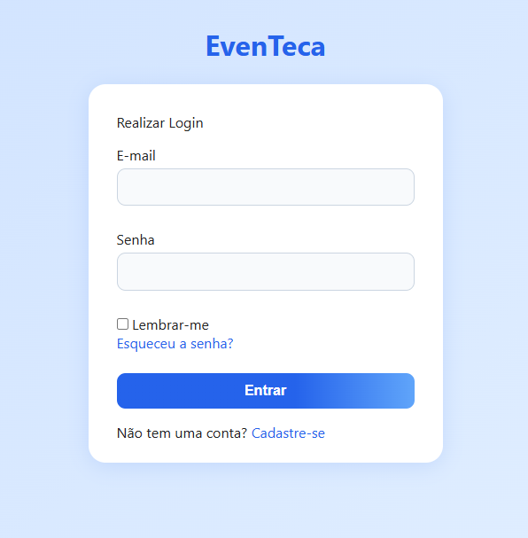
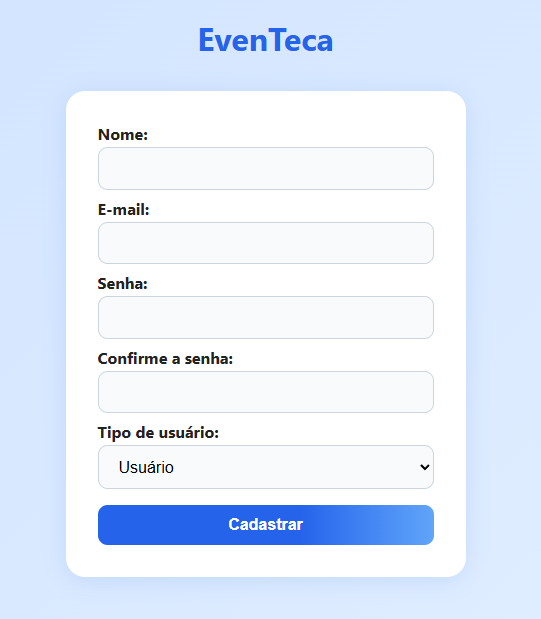
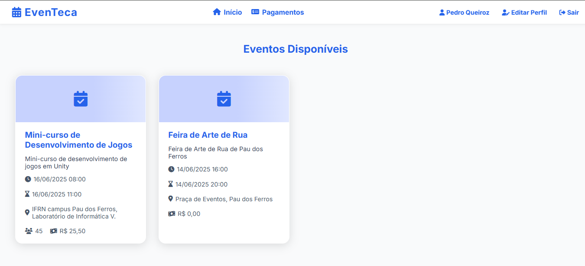
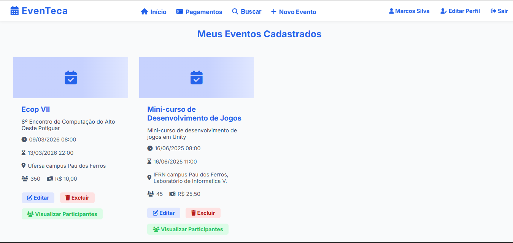
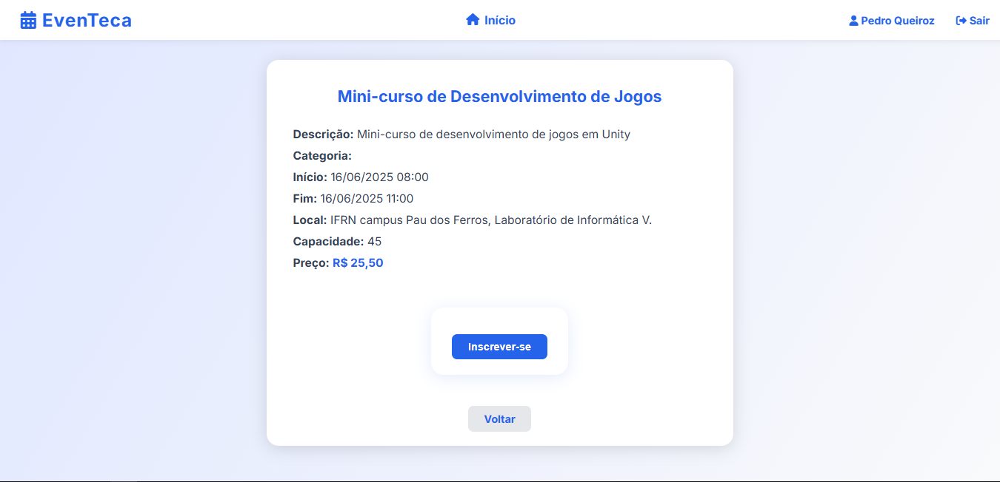
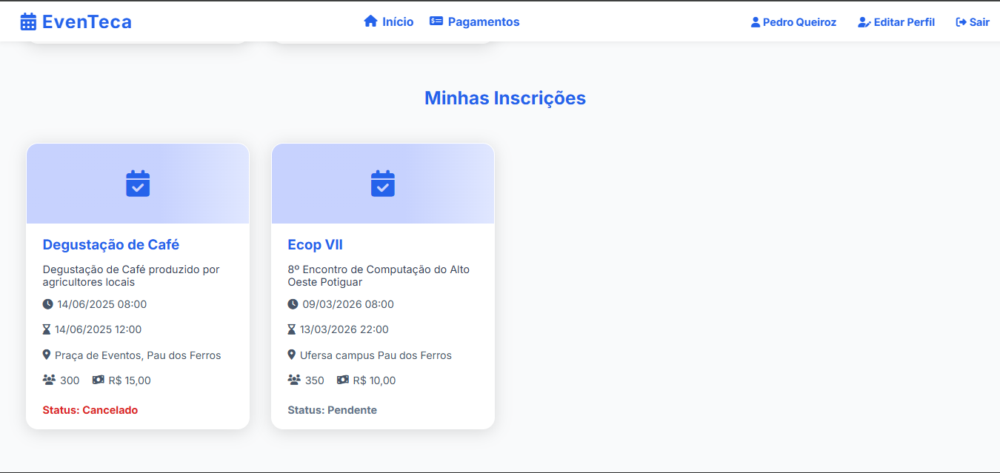
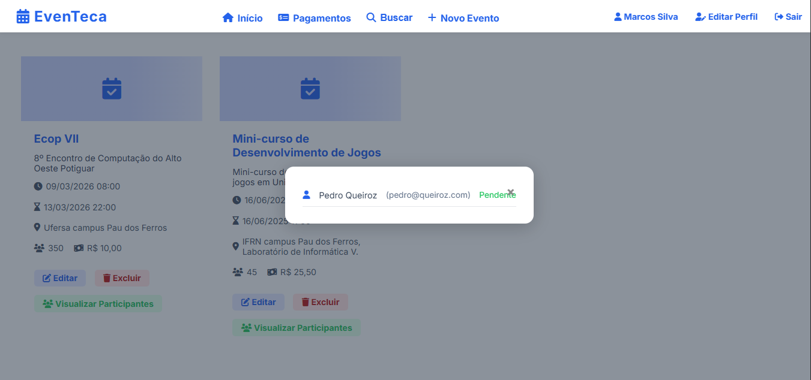
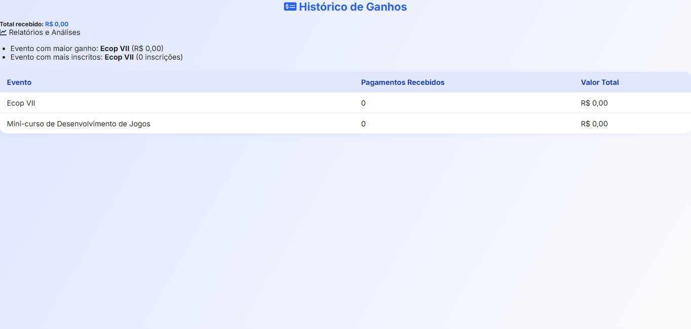

# EvenTeca

EvenTeca é uma plataforma web para gestão de eventos, inscrições e pagamentos, permitindo que administradores, organizadores e usuários interajam de forma eficiente. O sistema possibilita o cadastro de eventos, gerenciamento de participantes, controle de pagamentos, dentre outras funcionalidades.

- Usuário: Visualiza eventos, inscreve-se, paga inscrições e acompanha seu histórico.
- Organizador: Cria e gerencia eventos, acompanha inscrições e ganhos.
- Administrador: Gerencia usuários, eventos e acessa relatórios completos.

## Principais Funcionalidades

- Cadastro e autenticação de usuários
- Criação, edição e exclusão de eventos
- Inscrição em eventos com simulação de pagamento (cartão, Pix, boleto)
- Histórico de inscrições e pagamentos para usuários e organizadores
- Interface intuitiva e responsiva


## Imagens da Plataforma

<div align="center">

**Tela de Login**  


**Tela de Cadastro**  


**Home Usuário**  


**Home Organizador**  


**Inscrições em Evento**  


**Minhas Inscrições**  


**Visualizar Participantes**  


**Histórico de Pagamentos**  


</div>
</div>

## Tecnologias Utilizadas

- **PHP 8.2+**
- **Laravel 12**
- **Composer** (gerenciador de dependências PHP)
- **Filament** (admin, opcional)

O **back-end** do EvenTeca é desenvolvido em Laravel, que é um framework para desenvolvimento web baseado na arquitetura MVC (Model-View-Controller).
O **front-end** utiliza dos arquivos Blade do Laravel, que são arquivos semelhantes a Html mas que possibilitam o uso de loops e condicionais. 

## Passo a Passo para Execução

1. **Clone o repositório**
   ```bash
   git clone https://github.com/queirozPedro/even-teca
   ```
   
   ```bash
   cd even-teca
   ```

2. **Instale as dependências do backend**
   ```bash
   composer install
   ```

3. **Configure o ambiente**
   - Copie o arquivo `.env.example` para `.env`:
     ```bash
     cp .env.example .env
     ```

4. **Gere a chave da aplicação**
   ```bash
   php artisan key:generate
   ```

5. **Execute as migrações do banco de dados**
   ```bash
   php artisan migrate
   ```

6. **Inicie o servidor de desenvolvimento**
   ```bash
   php artisan serve
   ```

7. **Acesse a aplicação**
    - Abra o navegador em: [http://localhost:8000](http://localhost:8000)

---
Pronto! O EvenTeca estará rodando localmente. Para dúvidas ou contribuições, consulte a documentação do Laravel ou abra uma issue no repositório.

## Melhorias Futuras

- Customização da página do evento, acrescentando a possibilidade de upload de imagens, vídeos e gifs.
- Filtros de busca avançados, como filtros de data por intervalos de tempo.
- Suporte a métodos de pagamento reais.
- Dashboard com gráficos e métricas detalhadas que auxiliem os organizadores a medir o lucro de seus eventos.
- Testes automatizados e melhorias de segurança.
- Integração com o Google Agenda para cadastro de eventos e geração de lembretes.